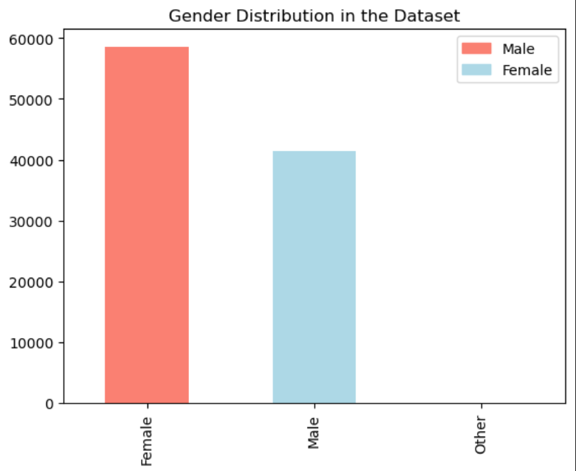

# Diabetes Prediction with Machine Learning

Welcome to the Diabetes Prediction project! This machine learning project aims to predict the likelihood of an individual having diabetes based on various health features.

## Table of Contents

- [Project Overview](#project-overview)
- [Dataset](#data)
- [Exploratory Data Analysis](#exploratory-data-analysis)
- [Model Building](#model-building)
- [Evaluation](#evaluation)
- [Tuning](#tuning)
- [Results](#results)

## Project Overview

The project uses machine learning algorithms to predict diabetes based on a dataset of health-related features. We explore the data, preprocess it, build predictive models, and evaluate their performance.

The frameworks/libraries used in this project:

- Python 3.11
- Libraries: NumPy, Pandas, Matplotlib, scikit-learn

## Dataset

The dataset used for this project contains health-related features, including age, BMI, and glucose levels. It's available in the data directory.

## Exploratory Data Analysis

We perform exploratory data analysis (EDA) to gain insights into the dataset, visualize feature distributions, and identify correlations.
